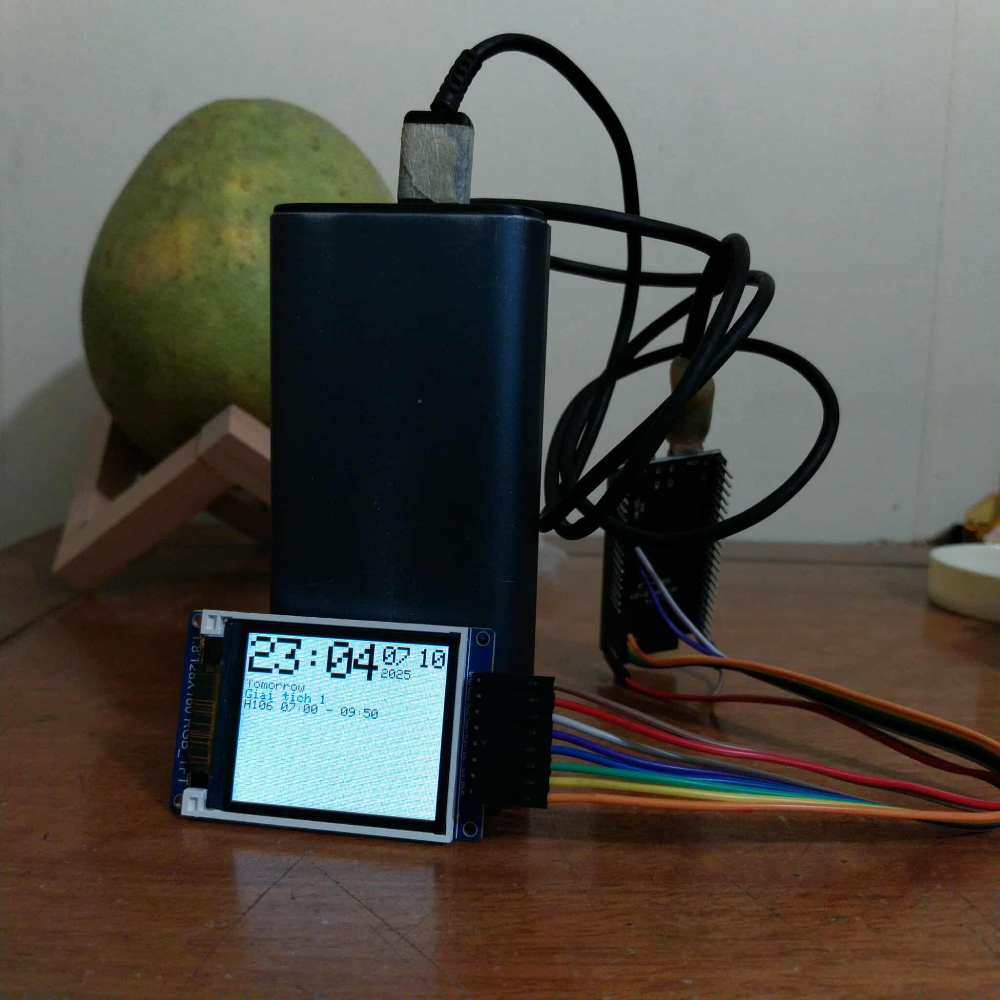

# mbed-dut-schedule
clock with schedule for DUT students, on an esp32s3 and a st7735 128x160 display

## how it works
when powered, the MCU will try to connect to a specified AP, then post a login request to sv.dut.udn.vn and save the response session id for future web scraps. now we can get any info exposed on the web interface. retrieved infomation then will be processed into usable format, and display onto the screen.
## features
[x] clock
[x] schedule
[ ] custom schedule
[ ] notices
## wiring
### esp32s3
|label   |pin|changeable|
|--------|---|----------|
|SCL/SCK |12 |no        |
|SDA/MOSI|11 |no        |
|RST     |4  |yes       |
|DC/A0   |5  |yes       |
|CS      |6  |yes       |
|BLK/VLED|7  |yes       |
### other mcu
you must find out which `SPI_ID` is available on your mcu **BEFORE putting any files on the mcu**, else it would reset constantly and you will need to install a new micropython on it. to do that, run `mpremote repl` then do:
```
>>> import machine
>>> machine.SPI(1)
>>> machine.SPI(2)
>>> machine.SPI(3)
...
```
and choose the one without any error/reset. 
after that, connect SCL/SCK and SDA/MOSI to the printed IO pin of the working `SPI_ID`. RST, DC, CS, BLK can be connected to any pin that isn't conflict with anything internally. reflect the changes on the first few line of `main.py`
## installation
- follow [micropython's documentation](https://micropython.org/download/) on how to install micropython to your mcu
- install [mpremote](https://docs.micropython.org/en/latest/reference/mpremote.html)
- edit the config file
```
cp config.json.example config.json
# then edit config.json

```
you can update your config after done installing by `mpremote cp config.json : && mpremote reset`
- then just run
```
chmod +x run.sh
./run.sh

```
let the script run until it's complete, then you can do <kbd>Ctrl</kbd> + <kbd>C</kbd> to exit
